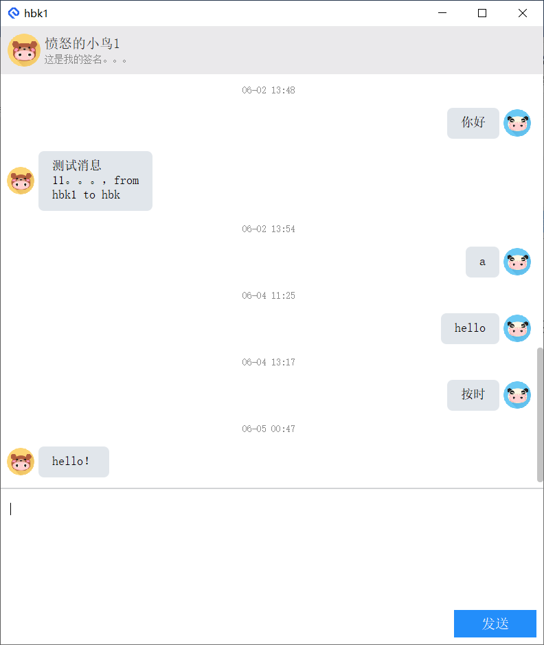

# Chat client Netease IM

## 环境配置
- 管理项目---cmake
- 编译器---VS2017
- UI包---Qt based MSVC
### 需要安装VS环境，编译器需要使用MSVC，测试的MinGW暂时不行。
### 需要Qt环境，需要使用MSVC编译的Qt资源包。
修改使用MSVC编译的Qt资源包路径[CMAKE_PREFIX_PATH](CMakeLists.txt#L5)

## 编译运行
```bash
mkdir build
cd build
cmake ..
cmake --build . --target NIMQtClient
copy ..\\nim_sdk\\bin\\* Debug
Debug\\NIMQtClient.exe
```

## 测试登录用户
目前注册功能暂未完善，提供以下测试用户
|username|hbk |hbk1|hbk2|hbk3|hbk4|hbk5|
|-------:|:--:|:--:| --:| --:| --:|---:|
|password|123456 |123456| 123456|123456 | 123456|123456|

## 界面

### 登录
[!login](image/login.png)

### 主界面
[!main](image/main.png)

### 用户信息
[!userinfo](image/userinfo.png)

### 添加好友
[!addfriend](image/addfriend.png)

### 创建群聊
[!createTeam](image/createteam.png)

### 聊天界面



